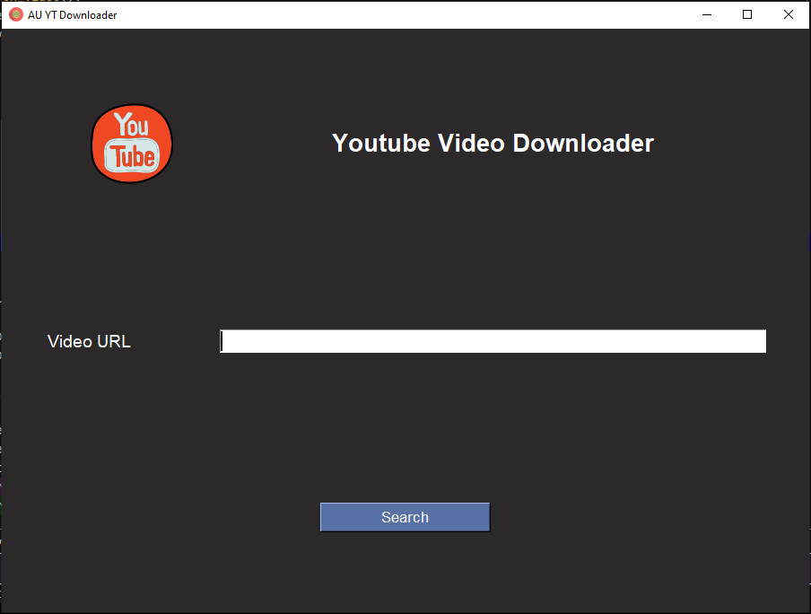
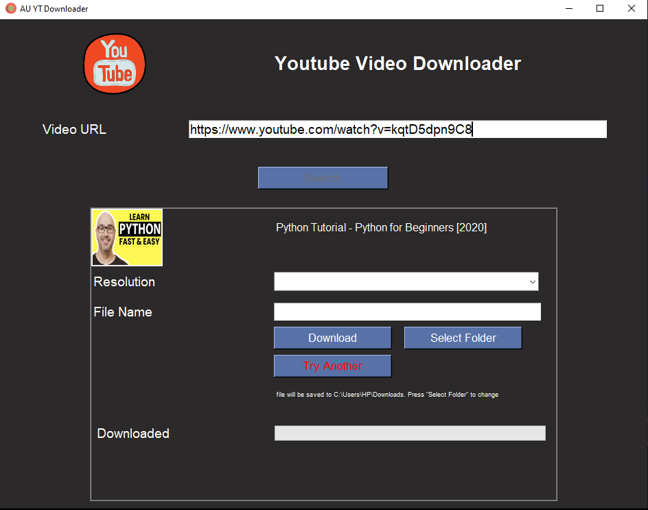
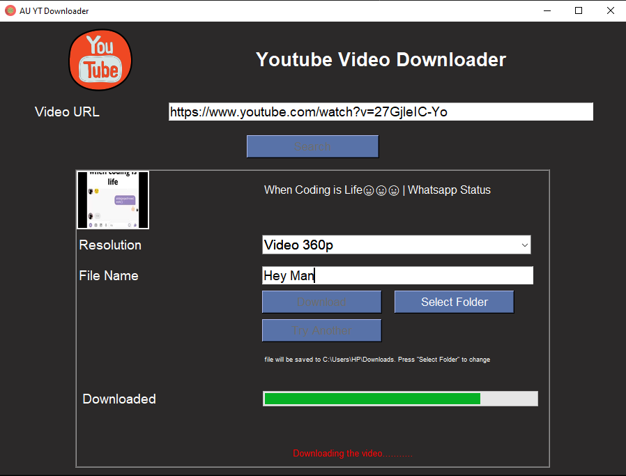
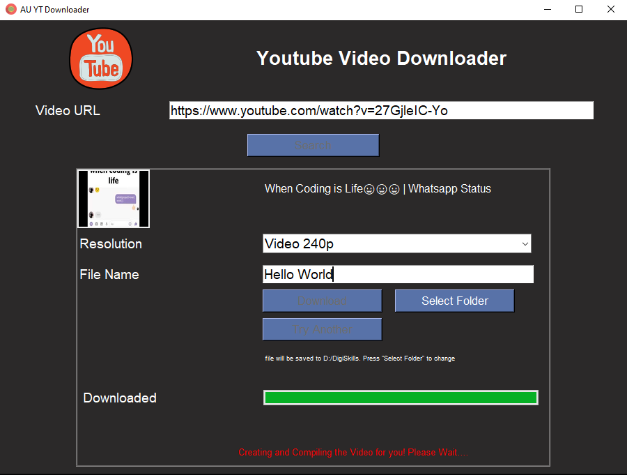

# Youtube-Video-Downloader
<h5>This repository holds the code for a custom desktop application that downloads and Edit a YouTube Video provided the URL.
The main features include that the user can download the video in any of the available resolution and if the required "codec"
for the video is not available, the program downloads the the audio and video separately
and compile it to make the final desired video and save it to the user defined location if user has defined else it finds the 
download folder on the machine and saves the file there. The interface (UI) is build using tkinter.</h5>
<h2> Home Screen </h2>



<h2>Search Results</h2>



<h2>File Downloading</h2>



<h2>File Downloading</h2>



<h2>Process Finished</h2>


## Setup Directories
```cmd
cd/you_desired_directory/
mkdir any_name
```
## Setting up Virtual Environment
```bash
python -m virtualenv env
env\Scripts\activate (windows) | Source\bin\activate (mac)
git clone -commit hash

# installing dependencies
python -r requirements.txt
```

#### You are set to develop amazing new features 🙂

### Main Dependencies

* pytube
* pymovie